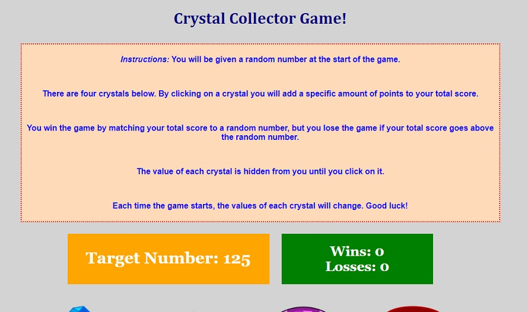

# Crystal-Collector-Game

In this project, a simple javascript game allows the user to select one of three crystals, each that have a random number between 1-29 assigned to it before each game starts.  They will then try to match the target score for that game (which also is randomly selected each game), by clicking on each crystal.  If they match the score, the game ends and the user earns a point, but if they end up going over the target score, then the game ends and everything is reset.  Good luck!

### Installing

Either follow the link to the hosted site, or users can clone the repo to their local machine and run the index.html file.

## Built With

* [HTML]
* [JavaScript]

## Authors

* **Matt Williams** - *Initial work* - [M Williams](https://mattwills09.github.io/portfolio.html)
